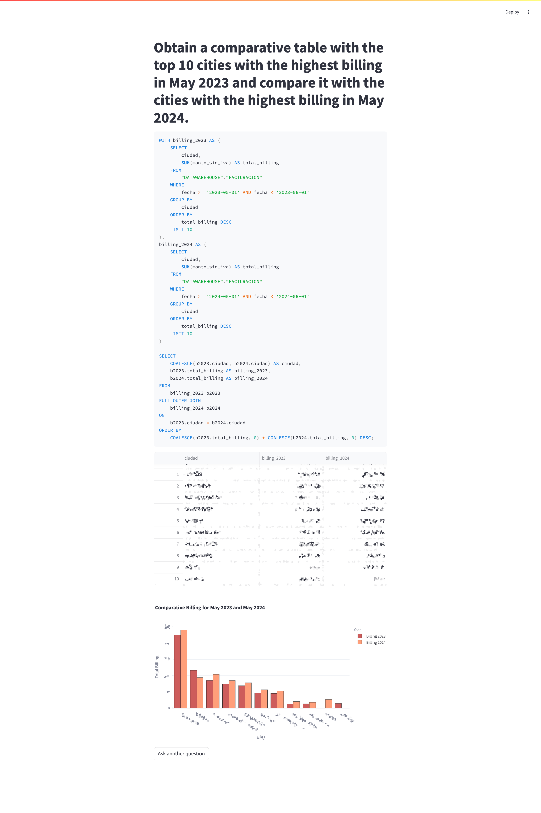

# Streamlit SQL Generation and Visualization App

This project is a Streamlit application that allows users to generate SQL queries based on natural language questions and visualize the results. It leverages the Vanna remote model to generate SQL queries and Plotly for data visualization.

## Author

**Quauhtli Martínez**  
[LinkedIn Profile](https://www.linkedin.com/in/quauhtlimtz/)

## Project Structure

- `main.py`: The main application logic.
- `config.py`: Configuration details including database and API keys.
- `config-sample.py`: Sample configuration file to be copied and updated with real values.
- `utils.py`: Utility functions, such as SQL query preprocessing.
- `logging_config.py`: Configuration for the logging system.
- `vanna_connector.py`: Handles the connection to Vanna and database operations.

## Features

- Natural language processing to generate SQL queries.
- PostgreSQL database connection.
- Visualization of query results using Plotly.
- Logging system for debugging and monitoring.

## Installation

1. Clone the repository:
    ```sh
    git clone https://github.com/yourusername/streamlit-sql-app.git
    cd streamlit-sql-app
    ```

2. Create a virtual environment and activate it:
    ```sh
    python -m venv .venv
    source .venv/bin/activate  # On Windows use `.venv\Scripts\activate`
    ```

3. Install the dependencies:
    ```sh
    pip install -r requirements.txt
    ```

## Configuration

1. Copy `config-sample.py` to `config.py`:
    ```sh
    cp config-sample.py config.py
    ```

2. Update `config.py` with your Vanna API key and PostgreSQL database configuration. 

You can obtain your Vanna API key by [creating an account on Vanna](https://vanna.ai/signup).

## Running the App

Run the Streamlit app:
```sh
streamlit run main.py
```

## Usage

	1.	Enter a natural language question in the text input.
	2.	The application will generate an SQL query based on the input question.
	3.	The SQL query will be executed, and the results will be displayed in a table.
	4.	If applicable, a Plotly chart will be generated based on the query results.

## Usage

You can ask the following question to the app:
“Obtain a comparative table with the top 10 cities with the highest billing in May 2023 and compare it with the cities with the highest billing in May 2024.”    



## Logging

Logs are stored in app.log. The logging configuration can be adjusted in logging_config.py.

## Table Design

```sql

-- "DATAWAREHOUSE"."FACTURACION" definition

-- Drop table

-- DROP TABLE "DATAWAREHOUSE"."FACTURACION";

CREATE TABLE "DATAWAREHOUSE"."FACTURACION" (
	id_factura bigserial NOT NULL, -- Identificador autoincrementable
	fecha date NULL,
	codigo_cliente varchar(100) NULL,
	codigo_movimiento numeric NULL,
	concepto varchar NULL,
	monto_sin_iva numeric NULL,
	ciudad varchar(100) NULL,
	CONSTRAINT "PK_id_factura" PRIMARY KEY (id_factura)
);
COMMENT ON TABLE "DATAWAREHOUSE"."FACTURACION" IS 'HISTORICO DE FACTURACION DE ENI NETWORKS';

-- Column comments

COMMENT ON COLUMN "DATAWAREHOUSE"."FACTURACION".id_factura IS 'Identificador autoincrementable';

-- Permissions

ALTER TABLE "DATAWAREHOUSE"."FACTURACION" OWNER TO yourusername;
GRANT ALL ON TABLE "DATAWAREHOUSE"."FACTURACION" TO yourusername;
```

## Special Note on `prepend_schema` Function

The `prepend_schema` function in `utils.py` is used to ensure that SQL queries generated by the application correctly reference the `DATAWAREHOUSE` schema and the `FACTURACION` table with double quotes. This is necessary because the database uses a specific schema and table names with double quotes. Additionally, the function adds the schema and table name before each field in the query. If the tables were in the default schema, this step would not be necessary for Vanna to generate valid SQL queries.

## License

This project is licensed under the MIT License. See the LICENSE file for more details.
